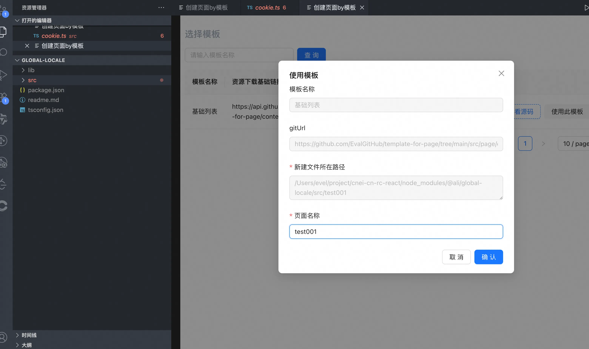

# Page Template Create VS Plugin

VS Code 插件：通过模板快速创建页面

## 背景介绍

在中后台项目开发中，存在着大量结构相似、重复度极高的页面。通常情况下，开发者只需要对这些页面进行简单的修改就能满足具体的业务需求。

传统的做法是在项目中通过复制粘贴的方式来快速创建新页面，虽然这种方式可以满足基本需求，但存在明显的局限性：

1. **复用效率低**：每次都需要手动复制粘贴文件，操作繁琐且容易出错
2. **维护困难**：当需要更新模板时，需要逐一修改所有已创建的页面
3. **团队协作问题**：不同开发者之间、跨项目组之间很难统一页面结构和规范
4. **标准化程度低**：缺乏统一的页面模板，导致项目代码风格不一致

为了解决这些问题，我们开发了这个基于在线模板的页面快速创建插件。通过统一的模板管理，团队成员可以快速创建符合规范的页面，大大提高了开发效率和代码一致性。

## 功能介绍

本插件提供以下核心功能：

1. **右键菜单快速创建**：在VS Code资源管理器中右键点击目标文件夹，选择"通过模板快速创建页面"命令
2. **可视化模板选择**：弹出Web界面，展示可用的页面模板列表
3. **在线模板下载**：从GitHub仓库下载指定模板到本地项目
4. **自定义页面命名**：支持自定义创建的页面名称和路径

## 使用方法

1. 在VS Code资源管理器中，右键点击你想要创建页面的目录
2. 选择"通过模板快速创建页面"命令
3. 在弹出的Web界面中选择合适的模板
4. 输入页面名称（会自动生成安装路径）
5. 点击"使用此模板"按钮完成创建

## 效果展示

## 使用要求

### 环境要求
- VS Code版本 >= 1.103.0
- Node.js环境（用于模板下载功能）
- 网络连接（用于从GitHub获取模板）

### 安装方式
1. 从VS Code Marketplace搜索并安装本插件
2. 或者下载插件包，在VS Code中手动安装

### 使用注意事项
- 确保目标目录具有写入权限
- 确保网络连接正常，以便从GitHub下载模板
- 避免在同一目录下创建同名页面

## 技术架构

插件采用模块化设计，主要包含以下组件：

- **插件主程序** ([extension.ts](file:///Users/evel/testproject/page-template-create-vs-plugin/src/extension.ts))：负责注册命令和初始化WebView
- **WebView提供者** ([web-view-provider.ts](file:///Users/evel/testproject/page-template-create-vs-plugin/src/web-view-provider.ts))：管理Web界面的创建和通信
- **工具函数** ([utils.ts](file:///Users/evel/testproject/page-template-create-vs-plugin/src/utils.ts))：提供文件操作和模板下载功能
- **前端界面** ([vite-project](file:///Users/evel/testproject/page-template-create-vs-plugin/vite-project))：基于React的模板选择界面

插件通过VS Code的WebView API实现界面展示，通过postMessage机制实现前后端通信。

## 开发指南

### 环境搭建
1. 安装pnpm包管理器
2. 安装依赖：`pnpm install`
3. 启动开发模式：`pnpm run watch`

### 构建发布
- 编译插件：`pnpm run compile`
- 打包发布版本：`pnpm run package`
- 运行测试：`pnpm run test`

## 已知问题

- 插件目前仅支持GitHub作为模板源
- 模板创建后需要手动调整部分业务逻辑代码
- 暂不支持模板的版本管理

## 更新日志

### 0.0.1
- 初始版本发布
- 支持通过右键菜单创建页面
- 集成基础模板选择界面
- 实现GitHub模板下载功能

---

**Enjoy!**
