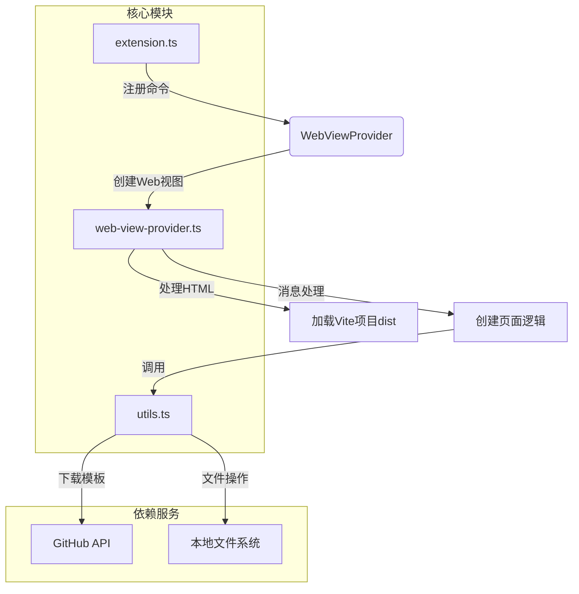

# 页面模板创建插件功能架构图

## 模块功能说明

1. **extension.ts**
   - 插件入口文件
   - 注册VS Code命令`page-create-by-template`
   - 初始化WebViewProvider

2. **web-view-provider.ts**
   - 管理Web视图生命周期
   - 处理HTML内容加载和资源路径转换
   - 实现页面创建的核心逻辑
   - 处理前端消息通信

3. **utils.ts**
   - 提供文件系统操作工具
   - 实现GitHub目录下载功能
   - 包含路径验证等辅助函数

## 主要流程

1. 用户触发`page-create-by-template`命令
2. WebViewProvider创建Web视图面板
3. 加载Vite项目构建的HTML内容
4. 用户在前端界面选择模板和路径
5. 通过消息通信触发页面创建
6. 调用utils下载GitHub模板到指定路径
7. 返回操作结果给前端界面
