# 插件数据状态流转图

```mermaid
graph TD
    A[用户操作] --> B
    B[VS Code<br/>右键菜单] --> C
    C[extension.ts<br/>触发命令] --> D
    D[web-view-provider.ts<br/>创建WebView面板] --> E
    E[vite-project/dist<br/>加载前端界面] --> F
    F[前端界面<br/>template-select] --> G
    G[用户选择模板和路径] --> H
    H[postMessage<br/>发送创建请求] --> I
    I[web-view-provider.ts<br/>接收消息] --> J
    J[utils.ts<br/>下载模板] --> K
    K[GitHub API<br/>获取模板文件] --> L
    L[本地文件系统<br/>写入文件] --> M
    M[postMessage<br/>返回结果] --> N
    N[前端界面<br/>显示操作结果] --> O
    O[用户查看结果] 

    style A fill:#FFE4C4,stroke:#333
    style B fill:#FFE4C4,stroke:#333
    style C fill:#87CEEB,stroke:#333
    style D fill:#87CEEB,stroke:#333
    style E fill:#98FB98,stroke:#333
    style F fill:#98FB98,stroke:#333
    style G fill:#98FB98,stroke:#333
    style H fill:#98FB98,stroke:#333
    style I fill:#87CEEB,stroke:#333
    style J fill:#87CEEB,stroke:#333
    style K fill:#87CEEB,stroke:#333
    style L fill:#FFE4C4,stroke:#333
    style M fill:#87CEEB,stroke:#333
    style N fill:#98FB98,stroke:#333
    style O fill:#FFE4C4,stroke:#333

    classDef frontend fill:#98FB98,stroke:#333;
    classDef backend fill:#87CEEB,stroke:#333;
    classDef external fill:#FFE4C4,stroke:#333;
    classDef vscode fill:#FFE4C4,stroke:#333;

    class F,G,H,N, frontend
    class C,D,I,J,K,M, backend
    class A,B,L,O, external
```



## 数据状态流转说明

### 1. 触发阶段
1. **用户操作** - 用户在VS Code中右键点击某个目录
2. **命令触发** - VS Code调用[extension.ts](file:///Users/evel/testproject/page-template-create-vs-plugin/src/extension.ts)中注册的命令
3. **创建面板** - [web-view-provider.ts](file:///Users/evel/testproject/page-template-create-vs-plugin/src/web-view-provider.ts)创建WebView面板并传递当前路径

### 2. 展示阶段
1. **加载前端** - WebView加载[vite-project/dist](file:///Users/evel/testproject/page-template-create-vs-plugin/vite-project/dist)目录中的前端资源
2. **界面展示** - 展示模板选择界面，包含模板列表和路径信息
3. **用户交互** - 用户选择模板、输入页面名称等操作

### 3. 通信阶段
1. **发送请求** - 前端通过`postMessage`向插件发送创建页面请求
2. **接收消息** - [web-view-provider.ts](file:///Users/evel/testproject/page-template-create-vs-plugin/src/web-view-provider.ts)接收来自前端的消息
3. **处理请求** - 调用[utils.ts](file:///Users/evel/testproject/page-template-create-vs-plugin/src/utils.ts)中的函数处理下载和创建逻辑

### 4. 执行阶段
1. **下载模板** - [utils.ts](file:///Users/evel/testproject/page-template-create-vs-plugin/src/utils.ts)通过GitHub API下载指定模板
2. **文件操作** - 在本地文件系统创建目录和文件
3. **返回结果** - 通过`postMessage`向前端发送操作结果

### 5. 反馈阶段
1. **结果展示** - 前端接收到结果并在界面中显示成功或失败信息
2. **用户查看** - 用户查看操作结果，完成整个流程

## 状态数据类型

### 前端向后端发送的数据
```javascript
{
  actionName: "createPage",
  value: {
    templateName: "基础列表",
    installPath: "/Users/xxx/project/src/page/newPage",
    pageName: "newPage",
    template: { /* 模板配置 */ },
    gitUrl: "https://github.com/...",
    gitDownloadUrl: "https://api.github.com/...",
    dirPath: "src/page/common-list",
    branch: "main",
    key: "common-list"
  }
}
```

### 后端向前端发送的数据
```javascript
// 发送当前路径
{
  type: "currentPath",
  data: {
    path: "/Users/xxx/project/src/page"
  }
}

// 创建成功
{
  type: "createPageSuccess"
}

// 创建失败
{
  type: "createPageFail"
}
```